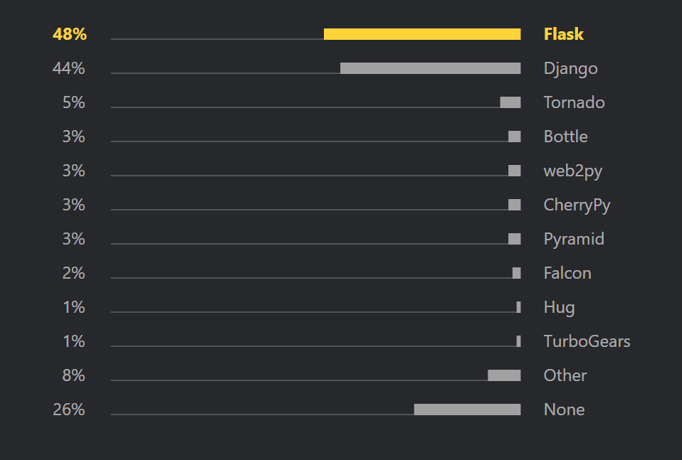

Django Paper
============

**Thesis:** Django is a popular web application due to its framework and
out-of-the-box features which allows Django to excel in building bigger,
complex projects.

Introduction

    * How are big complicated web applications like Instagram and Spotify built?
    * Thesis
    * Popularity
    * Framework and out-of-the-box features
    * Why its good for complex projects

* What is Django and how popular is it?

    * Describe what Django is
    * Talk about who uses Django (Use source [#f2]_)
    * Talk popularity among other python web frameworks
      (Use source [#f1]_ open source section)
    * Quickly state other python frameworks

What is Django and how popular is it?
-------------------------------------

Created in the early 2000's, Django is a well regarded Python based web
application that is gaining momentum in the industry. Created by
a couple programmers working for a newspaper company in Kansas, Django has
turned into a huge publicly available Python framework used by over thousands
of developers around the world [#f2]_. It has the philosophy of being free and
open-source, and has built popular websites used by people
everyday, including Pinterest, Instagram, The Washington Post, and Spotify [#f2]_.
Used by both big, popular websites and small, low volume websites, Django is
one of the most popular Python frameworks in the world.

According to the 2019 JetBrains Python Developers Survey, Django is in the top
two most popular Python web frameworks to use [#f1]_. One reason Django is one of
the most popular python frameworks is its strong open-source community. As of
October 26th, 2020, the Django Github repository has over 2000 contributors and
well over 500,000 dependencies to other repositories [#f1]_.

To compare numbers, Flask, another open-source Python web framework that came
in the top spot in the 2019 JetBrains Python Developers Survey, has well over
500,000 dependencies but only about 600 contributors.

Both Django and Flask have open-source communities that are large and very
active, which drives their popularity. Flask may be used for slightly more
projects, however with a lot more contributors, there is a lot more content
out there on Django [#f1]_.

Some other Python web frameworks besides Django and Flask include Tornado,
CherryPy, and Bottle. However, in the 2019 JetBrains Python Developers Survey,
44% of developers that have used Python based frameworks recorded using Django
before and 48% of developers recorded using Flask before. All other Python web
frameworks, including Tornado, CherryPy, and Bottle, recorded less than 5% of
developers [#f7]_.

    Web Frameworks, 2019 JetBrains Python Developers Survey [#f7]_.

* Intro to Various Django features which makes Django popular and gives
  Django the advantage over other Python frameworks

    * Framework
    * ORM
    * Out of the box extra features

So what makes Django a clear top 2 favorite in Python frameworks for developers?
First, Django forces a consistent app structure (MVT) that we will quickly
explain. Also, when looking into Django, you'll quickly find that Django has
a TON of features that are built into the framework and are pluggable whenever
a developer needs it. If a developer needs account management, they can just
plug it in. If a developer needs an admin panel for CRUD activities, they can
just plug it in. Django has a lot of features that are completely pluggable
that we will go over.

Framework
---------

    * MVT architecture (Show figure from source [#f2])
    * Talk about models

        * Is a Python class
        * Keeps your business logic
        * Generally each model maps to one database table

    * Talk about views

        * Accepts HTTP requests
        * Applies the models/Python classes
        * Provides HTTP responses or provides data to templates

    * Talk about templates

        * Is simply HTML code to show data
        * Can be static or dynamic

    * Can adjust visual part of app and logic separately
    * Asynchronous Views

* ORM in Django (Use source [#f5])

    * ORM is a Object Relational Mapper
    * Allows queries on databases without raw SQL
    * Include and talk about cool figure in source 2 explaining ORM
    * Speeds up web application development
    * Include an example from source 5 (Show code snippets)

* Out of the box web security features (Use source [#f3])

    * Security against most common web-attacks
    * cross-site scripting

        * Django templates escape dangerous characters

    * cross-site request forgeries

        * Works by checking for a secret (through a cookie) in each POST request

    * SQL-injection

* Out of the box Account management & Authentication ([#f1] and [#f3])

    * Log-ins and log-outs
    * Web apps requires authentication to know who you are
    * Web apps requires authorization to know what you are allowed to do/see

* Out of the box admin panel ([#f1] and [#f2])

    * Is a user interface for managing data for CRUD applications
    * No extra code is needed to do CRUD activities
    * Not included in other Python frameworks

* Django excels at building complex projects

    * Why Django excels

        * Framework
        * admin panel
        * Account management
    * Quickly state why other frameworks aren't as good

* Conclusion

.. [#f1] Herman, M. (2020, October 28). "`Django vs. Flask in 2020: Which Framework to Choose. <https://testdriven.io/blog/django-vs-flask/>`_" Test Driven Labs.
.. [#f2] Zublenko, E. "`Why Django is the Best Web Framework for Your Project. <https://steelkiwi.com/blog/why-django-best-web-framework-your-project/>`_" SteelKiwi INC.
.. [#f3] Grehan, R. (2011, August 10). "`Pillars of Python: Django Web framework; Django combines excellent backward compatibility, good admin tools, and a focus on developer ease <https://link.gale.com/apps/doc/A263931054/GPS?u=simpsoncoll&sid=GPS&xid=22b37d98>`_" InfoWorld.com.
.. [#f4] Dauzon, S., Bendoraitis, A., & Ravindran, A. (2016). "`Django: Web Development with Python. <https://search.ebscohost.com/login.aspx?direct=true&AuthType=ip,url,uid,cookie&db=e000xna&AN=1345264&site=ehost-live&scope=site>`_" Packt Publishing.
.. [#f5] Ljødal, S. (2019) "`Pushing the ORM to its limits. <https://2019.djangocon.eu/talks/pushing-the-orm-to-its-limits/>`_" DjangoCon 2019, Copenhagen, Denmark.
.. [#f6] "`Security in Django. <https://docs.djangoproject.com/en/2.2/topics/security/>`_" Django Software Foundation.
.. [#f7] Python Software Foundation. (2019). "`Python Developers Survey. <https://www.jetbrains.com/lp/python-developers-survey-2019/>`_" JetBrains.