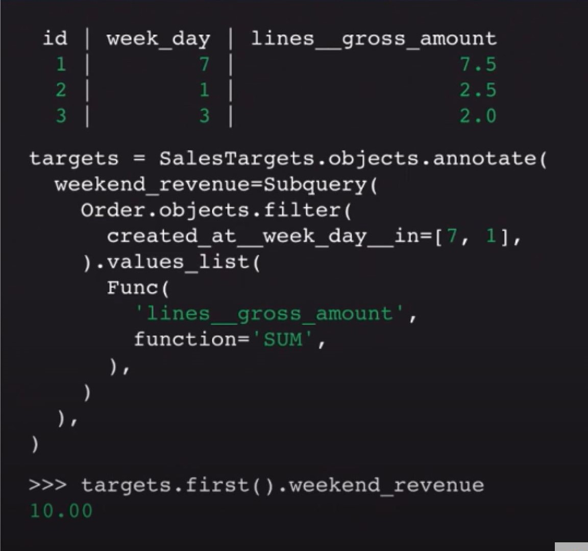

Django Paper
============

**Thesis:** Django is a popular web application due to its framework and
out-of-the-box features which allows Django to excel in building bigger,
complex projects.

Introduction

    * How are big complicated web applications like Instagram and Spotify built?
    * Thesis
    * Popularity
    * Framework and out-of-the-box features
    * Why its good for complex projects

What is Django and how popular is it?
-------------------------------------

Created in the early 2000's, Django is a well regarded Python based web
application that is gaining momentum in the industry. Created by
a couple programmers working for a newspaper company in Kansas, Django has
turned into a huge publicly available Python framework used by over thousands
of developers around the world [#f2]_. It has the philosophy of being free and
open-source, and has built popular websites used by people
everyday, including Pinterest, Instagram, The Washington Post, and Spotify [#f2]_.
Used by both big, popular websites and small, low volume websites, Django is
one of the most popular Python frameworks in the world.

According to the 2019 JetBrains Python Developers Survey, Django is in the top
two most popular Python web frameworks to use [#f1]_. One reason Django is one of
the most popular python frameworks is its strong open-source community. As of
October 26th, 2020, the Django Github repository has over 2000 contributors and
well over 500,000 dependencies to other repositories [#f1]_.

To compare numbers, Flask, another open-source Python web framework that came
in the top spot in the 2019 JetBrains Python Developers Survey, has well over
500,000 dependencies but only about 600 contributors.

Both Django and Flask have open-source communities that are large and very
active, which drives their popularity. Flask may be used for slightly more
projects, however with a lot more contributors, there is a lot more content
out there on Django [#f1]_.

Some other Python web frameworks besides Django and Flask include Tornado,
CherryPy, and Bottle. However, in the 2019 JetBrains Python Developers Survey,
44% of developers that have used Python based frameworks recorded using Django
before and 48% of developers recorded using Flask before. All other Python web
frameworks, including Tornado, CherryPy, and Bottle, recorded less than 5% of
developers (See figure below [#f7]_).

    Web Application, 2019 JetBrains Python Developers Survey

So what makes Django a clear top 2 favorite in Python frameworks for developers?
First, Django forces a consistent app structure (MVT) that we will quickly
explain. Also, when looking into Django, you'll quickly find that Django has
a TON of features that are built into the framework and are pluggable whenever
a developer needs it. If a developer needs account management, they can just
plug it in. If a developer needs an admin panel for CRUD activities, they can
just plug it in. Django has a lot of features that are completely pluggable
that we will go over.

Framework
---------

To use any of the cool Django plugins, Django forces you to use its MVT
architecture. MVT, standing for the layers models, views, templates, is how Django
organizes the web application. The three layers each control different parts of the
web app, and each one is used independent from the others.

The model layer is in charge of keeping all the business logic that is in the
web application. It is a python class, and contains fields for the data you need
and methods for handling the data [#f2]_. Any data manipulation happens in the
model layer, for example all create, read, update, delete (CRUD) activities
takes place in the model layer.

To enable the data manipulation that takes place in the model layer, each model
is usually connected to a database. Generally, each model class is connected to
one database table. A connection to a database is almost a requirement for any
new web applications in today's world, and Django enables those connections in
the model layer.

Since a model is only a simple Python class, something needs to get the data
once the model is done. Fetching the data from the model is the responsibility of
the view layer. Generally the view layer accepts HTTP requests, fetches data
from the model layer, and provides HTTP responses to clients [#f2]_.

To call a view, it must be mapped to a URL. When a client goes to that URL, a
view is called, and that view gives the correct HTTP response to the client [#f8]_.
A view will also raise any exceptions, like a Http404 error when a requested URL
can't be found.

To display the HTTP responses from the views, a template can be used. A template
is part of the template layer, and is loaded in the view. A template is a file
that contains html code to display data [#f2]_. A template can be static or dynamic,
and can use "template inheritance" to allow your entire application to look
similar without having to write the same HTML code over and over for each page [#f3]_ [#f8]_.

There are a lot of advantages of Django's MVT structure. First, it allows
developers to change the logic in the application and the visual part of the
application separately. A developer can be confident that any logic changes won't
change the visual side of the site, and vice-versa.

A second advantage is Django apps all have a consistent structure. This allows
teams running big web applications using Django to bring in different developers,
and as long as those developers are experienced Django developers, they will be
able to quickly orient themselves since all Django projects have consistent
structure.

A third advantage of the framework is it allows the web application to be easily
pluggable, which is where Django really excels at [#f2]_. When installing
Django, many of these plug-ins you need to build a web application
are automatically installed, including an ORM,  a template library, web security
features, an administration interface, and other support libraries and useful
applications [#f3]_.

ORM
---

The first plug-in that is a real strength of Django is its Object Relational
Mapper (ORM). Automatically installed alongside Django, the ORM helps
developers interact with the database by automatically transferring the data
stored in databases into objects [#f2]_.

An ability of using the built-in ORM is that it allows developers to do queries
on databases without using raw SQL. To do this, the query is run on the stored
objects and not by fetching the data from the database [#f5]_. An example of a
query using the ORM is below [#f5]_.

Here we are doing a subquery on the small data table at the top of the image.
Our goal of the query is to find the total revenue on weekdays 1 and 7. The
subquery finds all the rows in the table that occurred on weekdays 1 or 7 using the
.filter() method. Then, using the .values_list() method, it sums up all the
values in the lines_gross_amount column in the subquery. At the bottom, we
call the first row of the query, and get the expected result of 10.00 [#f5]_.

Web Security
------------

Another out-of-the-box feature included with the installation of Django is web
security for their web applications. A developer can enable a couple of
features that helps secure their application against most common web-attacks [#f3]_.
The first web-attack Django protects against is cross-site scripting, which can
allow a user to inject malicious scripts into the browsers of other users. Django
protects against these attacks by having Django templates automatically escaping
specific characters which are dangerous to HTML [#f6]_.

Another common web-attack Django protects against is cross-site request forgery.
This type of attack lets a malicious user to perform actions using the credentials
of another unknowing user. When enabled and used correctly, Django can protect
against this attack by checking for a cookie in each POST request [#f6]_.

The third common web-attack Django protects against in SQL injection. SQL
injection occurs when a malicious user can somehow execute SQL code on the
web application's database. Django protects against this attack by constructing
Django querysets using query parameterization [#f6]_. Django allows the developers the
ability to write raw SQL but it should only be used if absolutely necessary.

Account Management & Authentication
-----------------------------------

Django also provides a built in session management system, which handles
server-side session information and abstracting the passing of cookies as
mechanisms for session support. It also can support the concepts of users and
groups [#f3]_. These functionalities are supported by the models.user class
which comes with Django out-of-the-box. The fields in the User object includes [#f4]_:

    * username (required)
    * first_name (optional)
    * last_name (optional)
    * email (optional)
    * password (required, stores a hash of the password)
    * groups
    * user_permissions
    * is_staff
    * is_active
    * is_superuser
    * last_login
    * date_joined

The models.user class also has methods: [#f4]_

    * get_username()
    * set_password(raw_password)

        * Sets user’s password to the raw string, taking care of the password hashing.

    * check_password(raw_password)

        * Returns True if the raw string is the correct hashed password

    * has_perm(perm)
    * a lot more!

Admin Panel
-----------

One of the most powerful parts of Django is its built in admin panel, which really
makes Django shine [#f1]_. The admin panel is a web application that provides an
interface for the user to manage data. This allows developers to quickly perform
CRUD operations without writing extra code. A couple lines of code in the setup
enables this feature, allowing a quick setup of this powerful tool. A developer
can also enable a login requirement to access the admin panel, and by default,
a user must be a superuser to be able to gain access [#f9]_.

Django Excels at Building Complex Projects
------------------------------------------

As you can see, Django has a lot of cool features and abilities that can be
plugged in with a couple clicks or couple lines of code. These abilities are
what makes Django so popular, however, Django is not as popular for small scale
applications. A disadvantage of Django is if a developer needs to make a static
website or a simple chat site, Django is likely overkill, and the developer
probably should use other python frameworks, such as Flask, instead [#f1]_ [#f2]_.
However, if a developer is building a complex website, Django should be the
leading choice of framework with its many advantages, including the many
pluggable features (ORM, Admin Panel, Account Management, Security, and more),
and the consistent Django architecture to allow a rollover of Django developers
along the web application's lifespan.

Conclusion
----------

Sources
----------

.. [#f1] Herman, M. (2020, October 28). "`Django vs. Flask in 2020: Which Framework to Choose. <https://testdriven.io/blog/django-vs-flask/>`_" Test Driven Labs.
.. [#f2] Zublenko, E. "`Why Django is the Best Web Framework for Your Project. <https://steelkiwi.com/blog/why-django-best-web-framework-your-project/>`_" SteelKiwi INC.
.. [#f3] Grehan, R. (2011, August 10). "`Pillars of Python: Django Web framework; Django combines excellent backward compatibility, good admin tools, and a focus on developer ease <https://link.gale.com/apps/doc/A263931054/GPS?u=simpsoncoll&sid=GPS&xid=22b37d98>`_" InfoWorld.com.
.. [#f4] "`django.contrib.auth. <https://docs.djangoproject.com/en/2.2/ref/contrib/auth/>`_" Django Software Foundation.
.. [#f5] Ljødal, S. (2019) "`Pushing the ORM to its limits. <https://2019.djangocon.eu/talks/pushing-the-orm-to-its-limits/>`_" DjangoCon 2019, Copenhagen, Denmark.
.. [#f6] "`Security in Django. <https://docs.djangoproject.com/en/2.2/topics/security/>`_" Django Software Foundation.
.. [#f7] Python Software Foundation. (2019). "`Python Developers Survey. <https://www.jetbrains.com/lp/python-developers-survey-2019/>`_" JetBrains.
.. [#f8] "`Django at a glance. <https://docs.djangoproject.com/en/2.2/intro/overview/#write-your-views>`_" Django Software Foundation.
.. [#f9] "`The Django admin site. <https://docs.djangoproject.com/en/2.2/ref/contrib/admin/>`_" Django Software Foundation.
